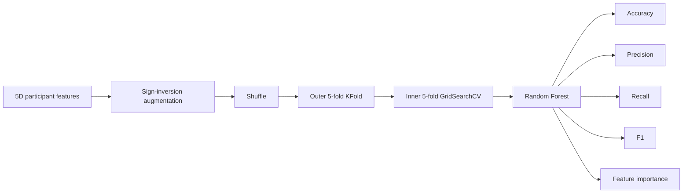

# ML-PSG-ADHD-Analysis

**Graph-based polysomnography analysis and machine learning for sleep-stage-specific ADHD biomarkers**

[](https://www.python.org/)
[](https://doi.org/10.1109/ISBI60581.2025.10981031)
[](.github/workflows/ci.yml)

This repository reconstructs, documents, and tests the computational
workflow associated with the IEEE ISBI 2025 study:

> **Machine Learning-Based Polysomnography Data Analysis for ADHD Diagnosis: A Focus on Sleep Stage-Based Biomarkers**

The project investigates whether sleep-stage-specific graph features
derived from polysomnography (PSG) signals can support machine-learning
classification of ADHD and control participants.

The repository contains preserved historical implementations, a cleaned
reusable Python package, automated tests, synthetic public examples,
canonical publication-result records, reproducibility documentation,
and continuous-integration validation.

> **Research-use notice:** This repository is research software and is
> not intended for clinical diagnosis, treatment decisions, or patient
> care.

---

## Publication

**A. Eskorouchi, H. Wang, J. W. Lee, V. H. Nayak, N. B. Ojeda, and L.-W. Fan**,  
"Machine Learning-Based Polysomnography Data Analysis for ADHD Diagnosis: A Focus on Sleep Stage-Based Biomarkers,"  
*Proceedings of the 2025 IEEE 22nd International Symposium on Biomedical Imaging (ISBI 2025)*, Houston, TX, 2025, pp. 1-4.

**DOI:** [10.1109/ISBI60581.2025.10981031](https://doi.org/10.1109/ISBI60581.2025.10981031)

Citation files:

- [`CITATION.cff`](CITATION.cff)
- [`CITATION.bib`](CITATION.bib)
- [`docs/CITATION.md`](docs/CITATION.md)

---

## Study Overview

The published study included:

| Characteristic | Value |
| --- | ---: |
| Participants | 48 |
| ADHD participants | 25 |
| Control participants | 23 |
| Age range | 6-18 years |
| ADHD epochs | 20,294 |
| Control epochs | 19,968 |
| PSG channels | 17 |
| Epoch duration | 30 seconds |
| Sampling frequency | 512 Hz |
| Sleep-stage features | 5 |

The 17 PSG channels comprised:

- 8 EEG channels
- 2 EOG channels
- 5 EMG channels
- 2 ECG channels

---

## Method

The historical feature-extraction workflow constructs one graph feature
for each participant and sleep stage.


The five historical features correspond to:

| Historical feature | Sleep stage |
| --- | --- |
| `Sleep_ID_1` | Wake |
| `Sleep_ID_2` | Sleep Stage 1 |
| `Sleep_ID_3` | Sleep Stage 2 |
| `Sleep_ID_4` | Sleep Stage 3-4 |
| `Sleep_ID_5` | Rapid Eye Movement |

### Historical graph behavior

The reconstruction intentionally preserves the behavior of the original
implementation:

1. Pearson channel correlation is calculated for each epoch.
2. Absolute correlation values are used.
3. Epoch-level adjacency matrices are averaged within each
   participant-stage combination.
4. `networkx.from_numpy_array` constructs the graph.
5. The absolute correlation value itself is used as the edge weight.
6. Weighted shortest paths are calculated.
7. Returned path lengths are averaged into one stage-level feature.

This behavior is preserved even where alternative graph-distance
definitions could also be scientifically reasonable.

See [`docs/METHOD.md`](docs/METHOD.md).

---

## Historical Modeling Workflow

The standalone historical modeling implementation uses:



The historical Random Forest search grid is:

| Parameter | Values |
| --- | --- |
| `n_estimators` | 100, 200, 300 |
| `max_depth` | 10, 20, 30 |
| `min_samples_split` | 2, 5, 10 |
| `min_samples_leaf` | 1, 2, 4 |

The inner `GridSearchCV` refits according to accuracy.

See [`docs/MODELING.md`](docs/MODELING.md).

---

## Published Results

The reported average classification performance was:

| Metric | Value |
| --- | ---: |
| **Accuracy** | **0.72** |
| **Precision** | **0.71** |
| **Recall** | **0.85** |
| **F1 score** | **0.76** |

Machine-readable publication records are available under
[`results/`](results/).

These values are preserved as the **publication record**. They are not
claimed to have been regenerated from the public synthetic data.

See:

- [`docs/RESULTS.md`](docs/RESULTS.md)
- [`results/README.md`](results/README.md)

---

## Public Synthetic Demonstration

The original participant-level PSG recordings are **not distributed**
with this repository.

A fully artificial workflow is provided so that the software can be
exercised without protected clinical data.

```text
synthetic PSG
     |
     v
MNE Epochs FIF files
     |
     v
sleep-stage graph features
     |
     v
participant feature table
     |
     v
lightweight Random Forest smoke test
     |
     v
result tables
```

Run:

```bash
python scripts/run_synthetic_demo.py \
    --work-dir outputs/synthetic_demo \
    --participants 10 \
    --overwrite
```

The synthetic signals, labels, performance metrics, and feature
importances have **no clinical interpretation**.

See:

- [`docs/QUICKSTART.md`](docs/QUICKSTART.md)
- [`docs/SYNTHETIC_PSG.md`](docs/SYNTHETIC_PSG.md)
- [`docs/DATA_BOUNDARY.md`](docs/DATA_BOUNDARY.md)

---

## Installation

The reconstructed historical scientific environment used:

```text
Python          3.9.19
mne             1.6.1
numpy           1.26.4
pandas          2.2.2
networkx        3.2.1
matplotlib      3.8.4
seaborn         0.13.2
scikit-learn    1.4.2
```

Create a clean environment and install:

```bash
python -m pip install -r requirements.txt
```

For development and testing:

```bash
python -m pip install -r requirements-dev.txt
```

Or install the package in editable mode:

```bash
python -m pip install -e ".[dev]"
```

See [`docs/INSTALLATION.md`](docs/INSTALLATION.md).

---

## Command-Line Interfaces

### Extract graph features

```bash
python scripts/extract_features.py --help
```

### Run historical-compatible modeling

```bash
python scripts/run_modeling.py --help
```

### Generate artificial PSG

```bash
python scripts/generate_synthetic_psg.py --help
```

### Run the complete synthetic demonstration

```bash
python scripts/run_synthetic_demo.py --help
```

---

## Repository Structure

```text
ML-PSG-ADHD-Analysis/
|
|-- .github/
|   `-- workflows/
|       `-- ci.yml
|
|-- configs/
|   |-- historical_integrated_pipeline.yaml
|   `-- historical_modeling_pipeline.yaml
|
|-- docs/
|   |-- CITATION.md
|   |-- DATA.md
|   |-- DATA_BOUNDARY.md
|   |-- FEATURE_SCHEMA.md
|   |-- INSTALLATION.md
|   |-- LIMITATIONS.md
|   |-- METHOD.md
|   |-- MODELING.md
|   |-- PUBLICATION.md
|   |-- QUICKSTART.md
|   |-- RELEASE_CHECKLIST.md
|   |-- REPOSITORY_MAP.md
|   |-- REPRODUCIBILITY.md
|   |-- RESULTS.md
|   |-- SYNTHETIC_PSG.md
|   `-- VALIDATION.md
|
|-- examples/
|   |-- README.md
|   `-- synthetic_features/
|
|-- reference_implementations/
|   `-- published_pipeline/
|       |-- ADHD_Final_Code.py
|       |-- Feature extraction (Sleep stages).py
|       `-- README.md
|
|-- results/
|   |-- README.md
|   |-- RESULTS_PROVENANCE.csv
|   |-- published_performance_metrics.csv
|   |-- published_study_characteristics.csv
|   `-- sleep_stage_mapping.csv
|
|-- scripts/
|   |-- extract_features.py
|   |-- generate_synthetic_psg.py
|   |-- run_modeling.py
|   |-- run_synthetic_demo.py
|   `-- validate_repository.py
|
|-- src/
|   `-- psg_adhd/
|
|-- tests/
|
|-- CITATION.bib
|-- CITATION.cff
|-- Final_Manuscript.pdf
|-- LICENSE
|-- pyproject.toml
|-- requirements-dev.txt
|-- requirements-historical.txt
|-- requirements.txt
`-- README.md
```

For a detailed map, see
[`docs/REPOSITORY_MAP.md`](docs/REPOSITORY_MAP.md).

---

## Historical Source Preservation

The original computational implementations are preserved unchanged in:

[`reference_implementations/published_pipeline/`](reference_implementations/published_pipeline/)

Their SHA-256 hashes are validated automatically.

The cleaned package under `src/psg_adhd/` is designed to make the
historical behavior easier to inspect, test, and reuse while preserving
the original scripts as provenance records.

---

## Reproducibility Boundary

This repository distinguishes three different goals:

### 1. Publication-record preservation

Published study characteristics and metrics are retained as canonical
scientific records.

### 2. Historical behavioral reconstruction

Automated tests verify the reconstructed behavior of the historical
feature-extraction and modeling implementations.

### 3. Exact numerical reproduction

Exact regeneration of a historical model run is **not claimed**.

The standalone historical modeling script leaves several stochastic
operations unseeded, including:

- augmented-data shuffling
- outer KFold shuffling
- Random Forest fitting

In addition, the original protected PSG dataset is not publicly
distributed.

See [`docs/REPRODUCIBILITY.md`](docs/REPRODUCIBILITY.md).

---

## Validation

Run the repository-level integrity validator:

```bash
python scripts/validate_repository.py
```

Run all automated tests:

```bash
python -m pytest -q
```

The repository also includes GitHub Actions continuous integration:

[`.github/workflows/ci.yml`](.github/workflows/ci.yml)

Validation checks include:

- preserved historical SHA-256 hashes
- publication-result integrity
- public synthetic-data schema
- absence of tracked raw PSG data
- absence of generated runtime outputs
- absence of generated Python caches
- absence of workstation-specific paths
- executable CLI interfaces
- automated Python tests

See [`docs/VALIDATION.md`](docs/VALIDATION.md).

---

## Data Availability

Participant-level PSG recordings and protected clinical information are
not distributed through this repository.

Checked-in example feature tables are fully artificial and use
`SYN###` identifiers.

See:

- [`docs/DATA.md`](docs/DATA.md)
- [`docs/DATA_BOUNDARY.md`](docs/DATA_BOUNDARY.md)

---

## Limitations

Important limitations include:

- protected original PSG data are not publicly distributed;
- the historical modeling implementation contains unseeded stochastic
  operations;
- synthetic examples are intended only for software demonstration;
- published result records should not be confused with outputs from the
  synthetic demonstration;
- reconstructed historical graph behavior is preserved even when other
  graph-distance definitions might be considered.

See [`docs/LIMITATIONS.md`](docs/LIMITATIONS.md).

---

## Citation

If you use this repository or its associated methodology, please cite:

> A. Eskorouchi, H. Wang, J. W. Lee, V. H. Nayak, N. B. Ojeda, and L.-W. Fan, "Machine Learning-Based Polysomnography Data Analysis for ADHD Diagnosis: A Focus on Sleep Stage-Based Biomarkers," in *Proceedings of the 2025 IEEE 22nd International Symposium on Biomedical Imaging (ISBI 2025)*, Houston, TX, 2025, pp. 1-4. DOI: `10.1109/ISBI60581.2025.10981031`

Machine-readable citation metadata:

- [`CITATION.cff`](CITATION.cff)
- [`CITATION.bib`](CITATION.bib)

---

## License

See [`LICENSE`](LICENSE) for repository licensing information.

---

## Documentation

| Topic | Document |
| --- | --- |
| Quick start | [`docs/QUICKSTART.md`](docs/QUICKSTART.md) |
| Installation | [`docs/INSTALLATION.md`](docs/INSTALLATION.md) |
| Method | [`docs/METHOD.md`](docs/METHOD.md) |
| Modeling | [`docs/MODELING.md`](docs/MODELING.md) |
| Results | [`docs/RESULTS.md`](docs/RESULTS.md) |
| Data | [`docs/DATA.md`](docs/DATA.md) |
| Data boundary | [`docs/DATA_BOUNDARY.md`](docs/DATA_BOUNDARY.md) |
| Reproducibility | [`docs/REPRODUCIBILITY.md`](docs/REPRODUCIBILITY.md) |
| Limitations | [`docs/LIMITATIONS.md`](docs/LIMITATIONS.md) |
| Validation | [`docs/VALIDATION.md`](docs/VALIDATION.md) |
| Publication | [`docs/PUBLICATION.md`](docs/PUBLICATION.md) |
| Citation | [`docs/CITATION.md`](docs/CITATION.md) |
| Repository map | [`docs/REPOSITORY_MAP.md`](docs/REPOSITORY_MAP.md) |
| Release checklist | [`docs/RELEASE_CHECKLIST.md`](docs/RELEASE_CHECKLIST.md) |